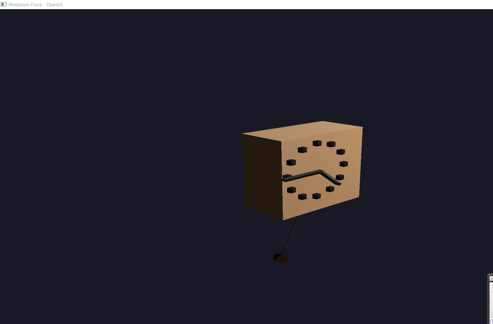

# Solar System 3D 🌍☀️🌙


A real-time 3D solar system simulation featuring the Sun, Earth, Moon, and Mars with realistic orbital mechanics, eclipse detection, and immersive camera controls. Built with C++ and modern OpenGL, this project demonstrates advanced 3D graphics concepts including orbital calculations, lighting, texturing, and shader programming.

## 📸 Screenshot



## ✨ Features

- **Realistic Orbital Mechanics:** Elliptical orbits for planets with accurate orbital speeds and rotations
- **Eclipse Detection:** Automatic detection and visualization of solar and lunar eclipses
- **Interactive Free Camera:** Full 6-DOF camera movement with mouse look controls
- **Earth-Following Camera:** Toggle to view the solar system from Earth's perspective
- **High-Quality Textures:** 2K-8K resolution textures for realistic planet rendering
- **Dynamic Lighting:** Real-time lighting calculations with sun and moon illumination
- **Orbital Path Visualization:** Visual representation of planetary orbits
- **Skybox Rendering:** Immersive starfield background
- **Modern OpenGL:** Utilizes OpenGL 3.3 Core profile with custom shaders
- **Clean Code Structure:** Well-organized project with modular components

## 🛠️ Technologies Used

- **Language:** C++17
- **Graphics API:** OpenGL 3.3 Core
- **Libraries:**
  - [GLFW](https://www.glfw.org/) (Windowing & Input)
  - [GLAD](https://glad.dav1d.de/) (OpenGL Loading)
  - [GLM](https://glm.g-truc.net/0.9.9/index.html) (Mathematics Library for Graphics)
  - [stb_image](https://github.com/nothings/stb) (Image Loading)

## 🚀 How to Build and Run

This project is configured for Visual Studio 2019/2022.

### Prerequisites

1.  **Visual Studio:** Make sure you have Visual Studio with the "Desktop development with C++" workload installed.
2.  **vcpkg (Recommended):** The easiest way to install dependencies.
    ```bash
    git clone https://github.com/Microsoft/vcpkg.git
    cd vcpkg
    ./bootstrap-vcpkg.bat # On Windows
    ./vcpkg integrate install
    ```
3.  **Install Dependencies with vcpkg:**
    ```bash
    ./vcpkg install glfw3 glad glm
    ```

### Building

1.  Clone this repository:
    ```bash
    git clone <repository-url>
    cd Sun-System
    ```
2.  Open the `TestGL.sln` solution file in Visual Studio.
3.  Make sure the project configuration is set to "Release" and platform is "x64".
4.  Build the solution by pressing `Ctrl+Shift+B` or going to `Build -> Build Solution`.

### Running

1.  Ensure the `TestGL/shaders/` and `TestGL/textures/` directories are in the same location as the final executable (they should be by default).
2.  Press `F5` in Visual Studio or run the `.exe` from the `x64/Debug/` or `x64/Release/` directory.

## 🎮 Controls

### Camera Movement

- **W/A/S/D:** Move camera forward/left/backward/right
- **Space / Left Shift:** Move camera up/down
- **Mouse Movement:** Rotate camera view (FPS-style)
- **Mouse Scroll:** Zoom in and out
- **V:** Toggle camera to follow Earth (press again to return to free camera)
- **ESC:** Exit the application

### Eclipse Features

- **G:** Speed up time and search for solar eclipse (Sun → Moon → Earth alignment)
- **H:** Speed up time and search for lunar eclipse (Sun → Earth → Moon alignment)
- **J:** Resume normal time speed after eclipse detection
- **R:** Reset all eclipse states and return to normal speed

## 🌟 Celestial Bodies

The simulation includes:

- **Sun:** Central star with high-resolution texture and dynamic lighting
- **Earth:** Features day/night textures, cloud layer, and axial rotation
- **Moon:** Earth's natural satellite with realistic orbital mechanics
- **Mars:** The red planet with elliptical orbit

## 🔬 Technical Details

- **Orbital Mechanics:** Elliptical orbits with semi-major and semi-minor axes
- **Eclipse Detection:** Real-time alignment checking using vector mathematics
- **Lighting Model:** Phong shading with sun and moon as light sources
- **Texture Mapping:** Multiple texture units for day/night/clouds on Earth
- **Skybox:** Cubemap-based starfield rendering

## 🤝 Acknowledgments

- Inspired by the amazing [LearnOpenGL.com](https://learnopengl.com/) tutorials
- Thanks to the authors of GLFW, GLAD, and GLM for their incredible libraries
- Planet textures sourced from various space visualization resources

---
